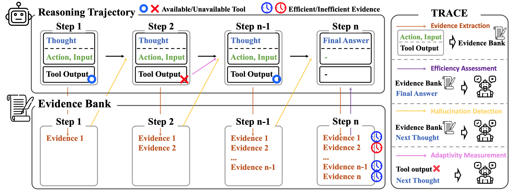

# Beyond the Final Answer: Evaluating the Reasoning Trajectories of Tool-Augmented Agents

The official source code for [**Beyond the Final Answer: Evaluating the Reasoning Trajectories of Tool-Augmented Agents**]

## Overview
Although recent tool-augmented benchmarks incorporate complex user requests and diverse tools, the evaluation methods for most of them remain limited to answer matching. However, as the number of steps required to resolve a user request increases, a proper evaluation of an agent’s performance must go beyond the final answer to also assess the problem-solving trajectory, including previously ignored aspects such as efficiency, hallucination, and adaptivity. The most straightforward method for evaluating these aspects is to compare an agent’s trajectory with the ground-truth trajectory, but this approach is fundamentally limited since annotating all valid ground-truth trajectories is prohibitively expensive. However, a simple LLM-based evaluator struggles to assess trajectories in detail without ground truth. To effectively evaluate the agents in this manner, we introduce TRACE, a framework for the multi-dimensional evaluation of tool-augmented LLM agent performance. By incorporating an evidence bank, which accumulates knowledge gathered from preceding reasoning steps, TRACE enables a multi-faceted analysis and evaluation of an agent’s reasoning trajectory effectively. To validate our framework, we develop a new meta-evaluation dataset by augmenting existing benchmarks with diverse and flawed trajectories, each labeled with multi-faceted performance scores. Our results confirm that TRACE accurately evaluates these complex behaviors in a scalable and cost-effective manner, even with small opensource LLMs. Furthermore, we apply our method to evaluate the trajectories that agents produce while solving tool-augmented tasks, presenting previously unreported observations and their corresponding insights.


</img> 

## Environment
You can configure the environment used during the experiments by entering the following code.

```bash
conda create -n TRACE python=3.11 
conda activate TRACE
pip install -r requirements.txt
```

## Meta-evaluation
```bash
python ./meta_evaluation/TRACE_evaluation --llm gpt-4.1 --dataset meta_gta
```

## Evaluation for various agents on GTA dataset
```bash
python trace.py --llm gpt-4.1 --input_files ./agents_output/claude-sonnet-4-0.json
```
